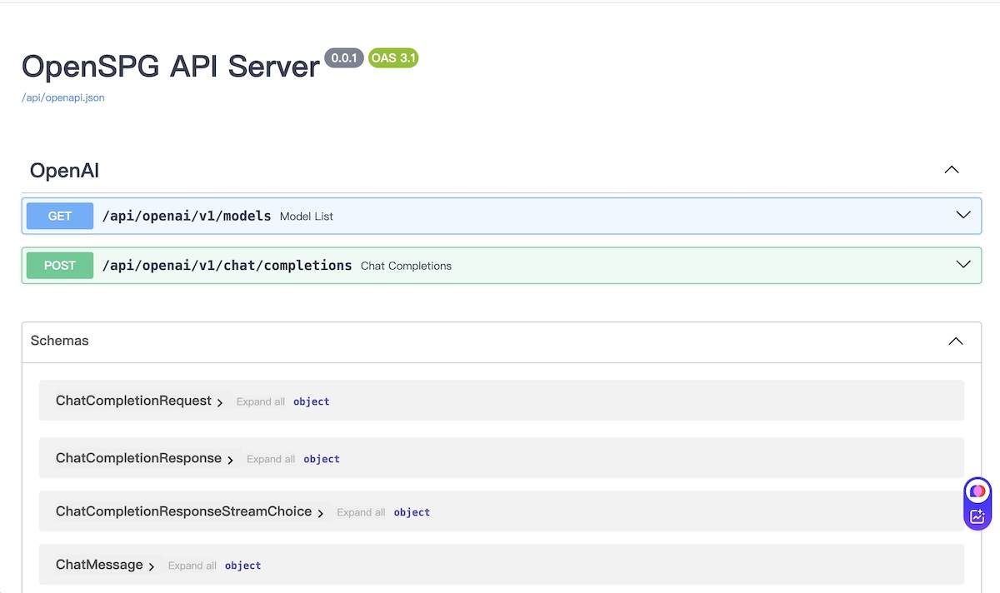

# OpenSPG Solver API in OpenAI Style

An OpenAI style API for OpenSPG Solver.

<div align="center">
    
</div>

## Environment

- Python 3.8+
- [KAG 0.6](https://github.com/OpenSPG/KAG)

## Install

- Clone the repository

```shell
git clone https://github.com/thundax-lyp/openspg-solver-api.git
cd openspg-solver-api
```

- Create Virtual Environment

```shell
create conda -n openspg-solver-api python=3.8
conda activate openspg-solver-api
```

- Install requirements

```shell
pip install -r requirements.txt
```

- Run API Server

```shell
python api.py --host=0.0.0.0 --port=8888 --openspg-service=http://127.0.0.1:8887
```

## API Document

```shell
http://127.0.0.1:8888/
```

## Test

### Models

> Request

```shell
curl -X 'GET' \
  'http://127.0.0.1:9999/api/openai/v1/models' \
  -H 'accept: application/json'
```

> Response

```json
{
  "object": "list",
  "data": [
    {
      "id": "openspg/TwoWiki",
      "object": "model",
      "created": 1742525286,
      "owned_by": "owner"
    },
    {
      "id": "openspg/BaiKe",
      "object": "model",
      "created": 1742525286,
      "owned_by": "owner"
    }
  ]
}
```

### Completions

> Request

```shell
curl -X 'POST' \
  'http://127.0.0.1:8888/api/openai/v1/chat/completions' \
  -H 'accept: application/json' \
  -H 'Content-Type: application/json' \
  -H 'Authorization: Bearer none' \
  -d '{
  "model": "openspg/BaiKe",
  "messages": [
    {
      "role": "user",
      "content": "周杰伦曾经为哪些自己出演的电影创作主题曲？"
    }
  ]
}'
```
